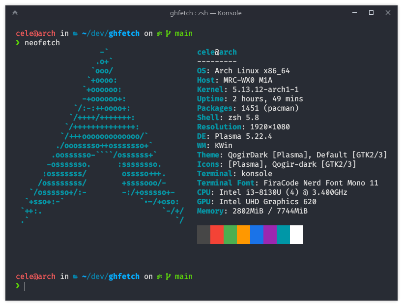
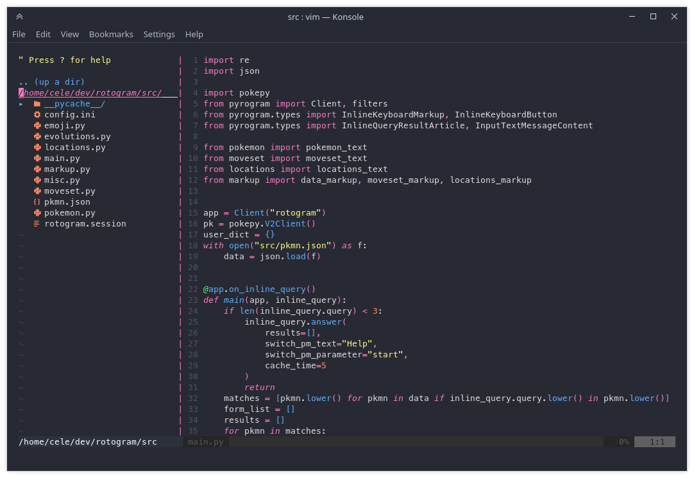

# Dotfiles
Arch Linux, KDE Plasma, Zsh and Neovim.
Updating Neovim config.
Soon i3 config.

## Installation
```
cd $HOME
git clone https://github.com/alessiocelentano/dotfiles
mv dotfiles/.* ./
pacman -S --needed - < pkg/pkglist.txt
paru -S --needed - < pkg/pkglist-aur.txt
```

## Other dotfiles
This is a list of old simple works (that's why this repo got so many stars, if you were wondering):
- [Colorful Material Dotfiles with floating bars (i3)](https://github.com/alessiocelentano/dotfiles/tree/c55f1c6aab7d66750df642ee391d804bfd002b5f) (2020/05)
- [Colorful Material Dotfiles v2 (i3)](https://github.com/alessiocelentano/dotfiles/tree/52f534574803c384015335aa10276a7b8d894313) [2020/06]
- [Blue Material/Nord (i3)](https://github.com/alessiocelentano/dotfiles/tree/def757afcd4825a6bbf80ef2c7d5510ce4d3f60c) [2020/07]
- [Everything is the background (Plasma+herbstluftwm)](https://github.com/alessiocelentano/dotfiles/tree/85871d2d72622990f36c94b5b5c7adff2dd6aed7) [2020/11]

## Gallery


