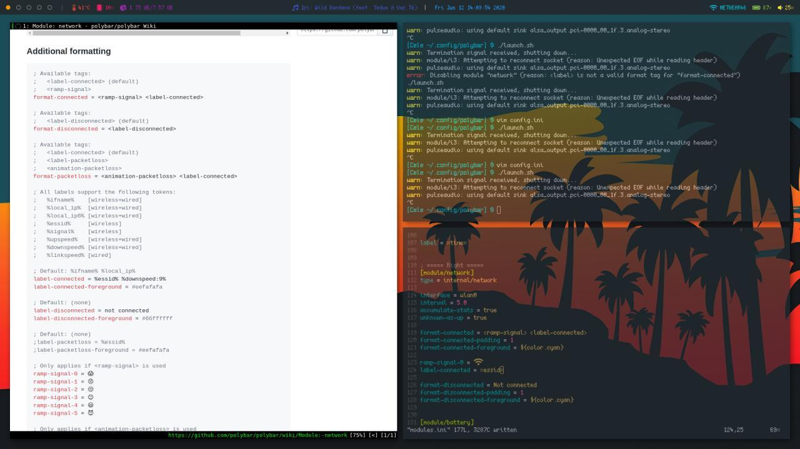

# CMD (Colorful-Material-Dotfiles)
Arch Linux + i3wm configuration by Alessio Celentano.


## Usage
**Warning**: before doing anything, I suggest forking this repo, check all files and edit/remove for the proper functioning of this configuration.

Then, simply clone this repository in your working directory.
```
cd ~
git clone https://github.com/alessiocelentano/Dotfiles.git
```
Finally, copy fonts in your system.
```
cp .config/polybar/fonts/* /usr/share/fonts
```
## Credits
* **Polybar-themes**: My Polybar is based on the Material Polybar 8 of this repository.<br>
* **Grub2-themes**: For the awesome GRUB themes and the script for switch them.
